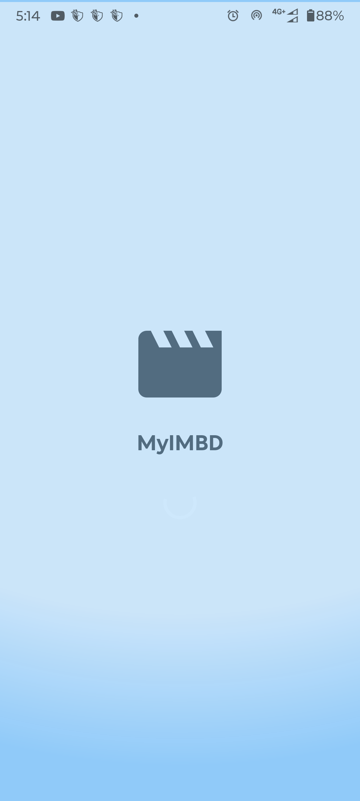
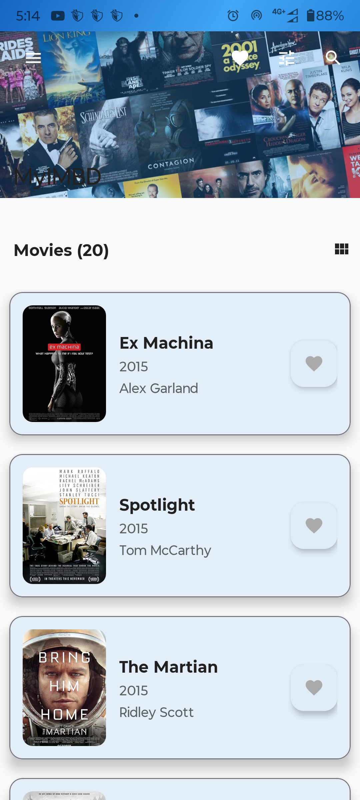
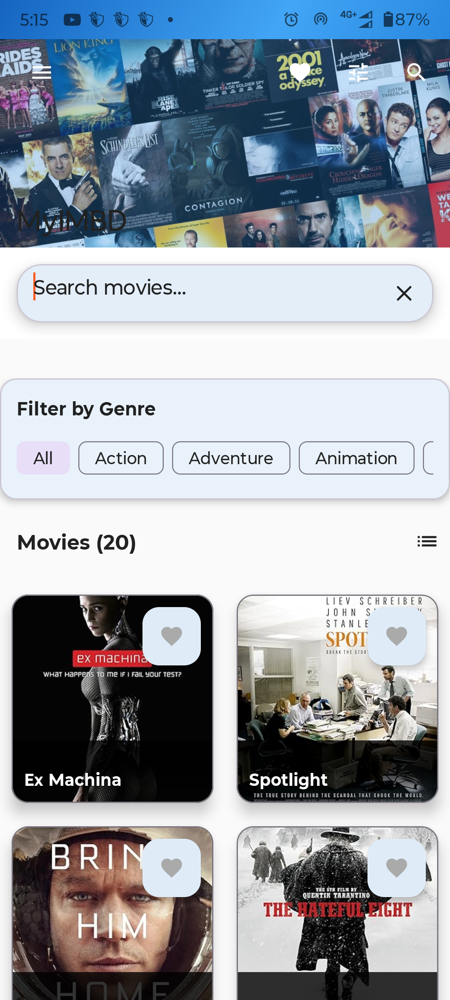
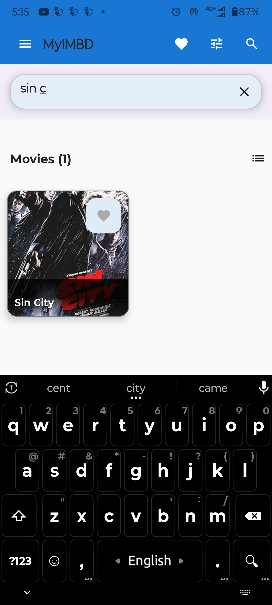
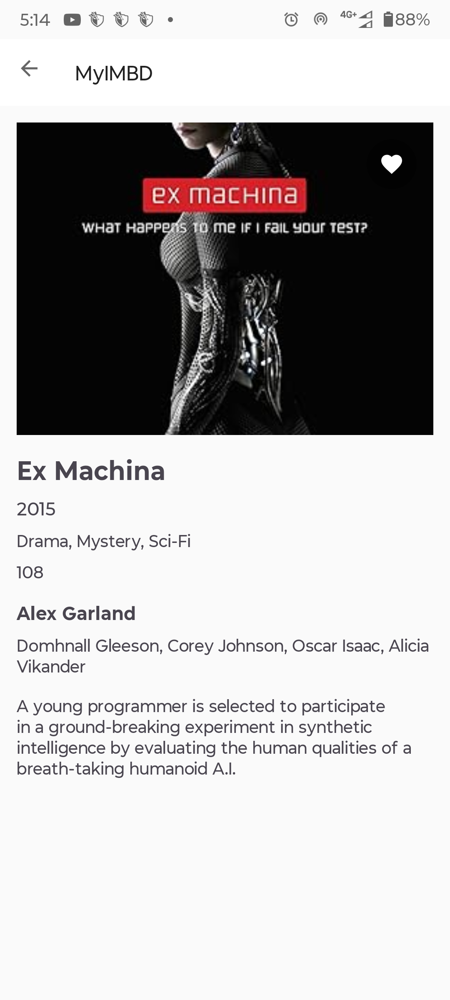

# MyIMBD - Modern Movie App

A modern Android movie application built with Clean Architecture, MVVM pattern, and Material Design principles. The app fetches movie data from a remote API and stores it locally for offline access.

## 🎯 Features

### Core Features
- **Splash Screen**: Checks internet connectivity and loads data once in a lifetime
- **Movie List**: Displays movies in reverse chronological order with pagination (10 per load)
- **Search**: Search movies by title or plot content
- **Filter**: Filter movies by genre through dropdown
- **Wishlist**: Add/remove movies to/from wishlist with animation
- **Movie Details**: Detailed view of movie information
- **Offline Support**: Works completely offline after initial data load

### Technical Features
- **Clean Architecture**: Separation of concerns with domain, data, and presentation layers
- **MVVM Pattern**: ViewModels with LiveData for state management
- **Dependency Injection**: Hilt for dependency injection
- **Local Storage**: Room database for offline data persistence
- **Network Layer**: Retrofit for API calls with OkHttp
- **Image Loading**: Glide for efficient image loading
- **Material Design**: Modern UI with Material 3 components

## 🏗 Architecture

The app follows Clean Architecture principles with three main layers:

### Domain Layer
- **Entities**: Movie data model
- **Repository Interface**: MovieRepository
- **Use Cases**: Business logic for movie operations

### Data Layer
- **Repository Implementation**: MovieRepositoryImpl
- **Local Data Source**: Room database with MovieDao
- **Remote Data Source**: Retrofit API service
- **Data Models**: DTOs for API responses

### Presentation Layer
- **Activities**: Main, MovieDetails, Wishlist, Splash
- **ViewModels**: State management with LiveData
- **Adapters**: RecyclerView adapters for movie lists

## 🛠 Tech Stack

- **Language**: Kotlin
- **UI**: XML layouts with Material Design
- **Architecture**: Clean Architecture + MVVM
- **Dependency Injection**: Hilt
- **Database**: Room
- **Networking**: Retrofit + OkHttp
- **Image Loading**: Glide
- **State Management**: LiveData
- **Min SDK**: 24
- **Target SDK**: 36

## 📱 Screens

1. **Splash Screen**: Loading screen with data synchronization
2. **Movie List**: Main screen with search, filter, and wishlist
3. **Movie Details**: Detailed movie information
4. **Wishlist**: List of wishlisted movies

## 📸 Screenshots

<div align="center">
  
  
  
  
  <br/>
  
</div>

## 📲 Download APK

- Latest build: [MyIMBD APK](screenshots/my_imbd.apk)
- Direct download: [MyIMBD APK (raw link)](https://github.com/antorparvez/MyIMBD-/raw/main/screenshots/my_imbd.apk)

## 🚀 Setup Instructions

### Prerequisites
- Android Studio Arctic Fox or later
- JDK 11 or higher
- Android SDK 24+

### Installation

1. **Clone the repository**
   ```bash
   git clone <repository-url>
   cd MyIMBDApp
   ```

2. **Open in Android Studio**
   - Open Android Studio
   - Select "Open an existing Android Studio project"
   - Navigate to the project directory and select it

3. **Sync project**
   - Wait for Gradle sync to complete
   - Resolve any dependency issues if prompted

4. **Run the app**
   - Connect an Android device or start an emulator
   - Click the "Run" button in Android Studio
   - The app will install and launch

### Build Configuration

The project uses Gradle with Kotlin DSL and includes:
- Multi-module architecture (app, domain, data)
- Hilt for dependency injection
- Room database configuration
- Retrofit network configuration

## 📊 API Integration

The app fetches movie data from:
```
https://raw.githubusercontent.com/erik-sytnyk/movies-list/master/db.json
```

### Data Flow
1. **Splash Screen**: Checks if local data exists
2. **First Launch**: Fetches data from API and stores locally
3. **Subsequent Launches**: Uses local data for offline operation

## 🎨 UI/UX Features

- **Material Design 3**: Modern UI components
- **Dark/Light Theme**: Automatic theme switching
- **Responsive Design**: Adapts to different screen sizes
- **Smooth Animations**: Wishlist button animations
- **Loading States**: Progress indicators for better UX
- **Empty States**: Informative empty state messages

## 🧪 Testing

The project includes:
- **Unit Tests**: For ViewModels and Use Cases
- **Instrumented Tests**: For database operations
- **Test Coverage**: Core business logic testing

## 📦 Project Structure

```
MyIMBDApp/
├── app/                          # Presentation layer
│   ├── src/main/java/com/myimbd/app/
│   │   ├── ui/                   # UI components
│   │   │   ├── main/            # Main activity
│   │   │   ├── moviedetails/    # Movie details
│   │   │   ├── wishlist/        # Wishlist screen
│   │   │   └── splash/          # Splash screen
│   │   └── MyIMBDApplication.kt
│   └── src/main/res/            # Resources
├── data/                         # Data layer
│   └── src/main/java/com/myimbd/data/
│       ├── local/               # Room database
│       ├── remote/              # API service
│       ├── repository/          # Repository implementation
│       └── di/                  # Dependency injection
├── domain/                      # Domain layer
│   └── src/main/java/com/myimbd/domain/
│       ├── model/               # Entities
│       ├── repository/          # Repository interfaces
│       ├── usecase/             # Use cases
│       └── di/                  # Domain DI
└── gradle/                      # Gradle configuration
```

## 🔧 Configuration

### Dependencies
- **Hilt**: `2.51`
- **Room**: `2.6.1`
- **Retrofit**: `3.0.0`
- **Glide**: `4.16.0`
- **Material**: `1.12.0`

### Build Features
- **View Binding**: Enabled for type-safe view access
- **Kotlin Kapt**: For annotation processing
- **Multi-module**: Clean separation of concerns

## 📈 Performance

- **Pagination**: 10 movies per page for optimal performance
- **Image Caching**: Glide handles efficient image loading
- **Database Indexing**: Optimized queries for fast retrieval
- **Memory Management**: Proper lifecycle management

## 🔒 Security

- **Network Security**: HTTPS API calls
- **Data Validation**: Input sanitization
- **Error Handling**: Graceful error management

## 🚀 Future Enhancements

- [ ] Unit test coverage improvement
- [ ] UI test automation
- [ ] Performance optimization
- [ ] Additional movie metadata
- [ ] User preferences
- [ ] Push notifications

## 📄 License

This project is developed as part of an Android Developer interview test. All code is original work.

## 👨‍💻 Developer

This project demonstrates:
- Clean Architecture implementation
- Modern Android development practices
- Material Design principles
- Offline-first approach
- Comprehensive error handling
- Scalable code structure

---

**Note**: This is a demonstration project showcasing modern Android development practices with a focus on clean architecture, offline capabilities, and user experience. 